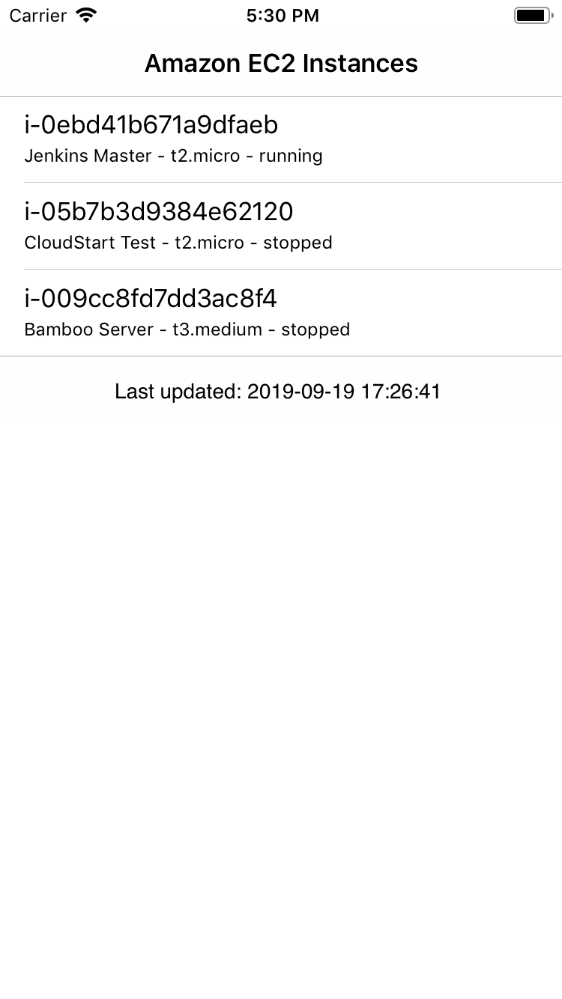
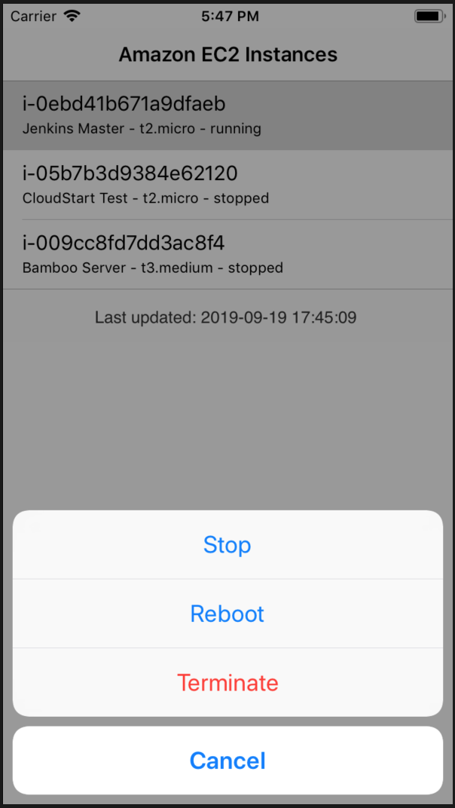
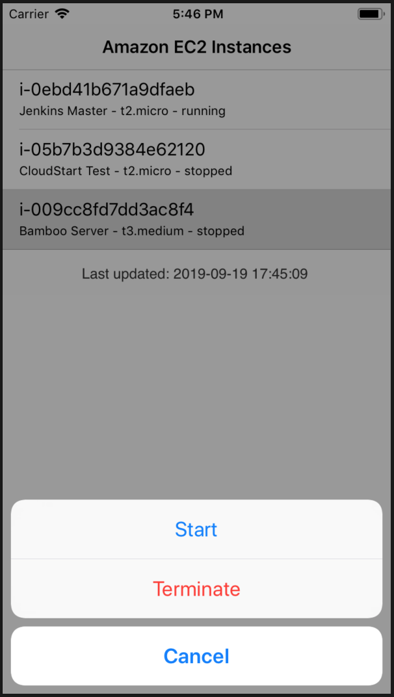

# CloudStart

### About
Native iOS app for managing Amazon EC2 instances.

  

### The other side
See AWS backend components [here](https://github.com/automatictester/cloudstart-backend).

### More
- Config file `aws_credentials.xcconfig` is not included for security reasons.
- This app has not been generalised, although feel free to reuse and adapt bits and pieces as you see fit.
